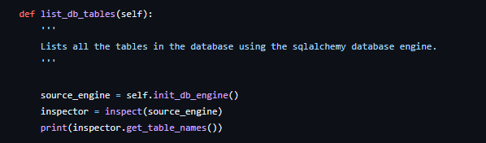
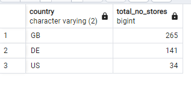
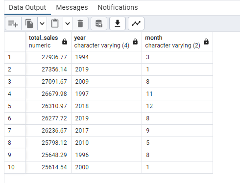

# Multinational-Retail-Data-Centralisation

This project involved extracting and cleaning data from multiple sources and sending this data into one centralised Postgresql database in pgAdmin4.

## Milestone 1

The first milestone was to set up the Github repository aswell as the dev environment. For this project several modules were imported including sqlalchemy, pandas, numpy, tabula and requests. 

## Milestone 2

The second milestone was to extract all of the necessary data from multiple sources and clean all of this data. First a database was set up within pgAdmin 4 called `sales_data` which was later used to store all the company information and data.

Then three python files were created `data_extraction.py`, `database_utils.py` and `data_cleaning.py` each with three separate classes intialised: `DataExtractor`, `DatabaseConnector` and `DataCleaning`.

- This class contained all the methods to help extract data from the different data sources.

- This class was used to connect with and upload data to the `sales_data` database.

- This class contained all the methods to clean the data from all of the sources.

# User data

The user data was the historical data of the users stored in an AWS database.

- A yaml file `db_creds.yaml` was created to contain all the database credentials containing the user data. This file was added to the `.gitignore` file so it wouldn't be visible publicly on Github. This method `read_db_creds()` was used to read this yaml file and return the credentials as a dictionary.

- The `init_db_engine()` method in the `DatabaseConnector` class was used to initialise and return a sqlalchemy database engine as the `source_engine` using the database credentials from earlier.

- The `list_db_tables()` was used to extract and list all the table names present within this database.

- The `read_db_tables()` method in the `DataExtractor` class was used to extract a database table to return a dataframe using a table name as an argument.

- The `clean_user_data()` method in the `DataCleaning` class was used to perform the cleaning of the user data. The `legacy_users` table was used to extract the user data firstly. Then the index value was set to the `index` column using `DF.set_index("index")`.

- Any null values were replaced with NaN and dropped using `DF.replace("NULL", np.nan)` and `DF.dropna()`.

- A mask was created to filter valid countries, eliminating any irregular values in this column using `DF["column_name"].isin()` and then `DF[mask]`.

- The incorrect country code of `GGB` was replaced with `GB` using `DF.replace()`.

- Finally the dates were put into the correct format using `pd.to_datetime(DF["column_name"], format="mixed")`. This cast the column into the date time format while the `"mixed"` flag accounted for different date formats.

- The `upload_to_db()` method was used to upload data to the `sales_data` database using new credentials from the yaml file aswell as the dataframe and desired table name within pgAdmin4 as arguments.  

- The `DatabaseConnector()` class was intialised and the `DataCleaning()` class was imported and also intialised to return the cleaned user data as `clean_user_data` and then upload this data to the database under the table name `dim_users`.

# Card data

The card data was the data of the users card details stored in a PDF in an AWS S3 bucket.

- The `retrieve_pdf_data()` method was used to extract all pages of card details data from a pdf file to return a dataframe using the S3 link. Various flags such as `multiple_tables=True`, `pages="all"` and `lattice=True` were used to ensure all the correct data was extracted.

- The `clean_card_data()` method was used to perform the cleaning of the card data and the index was reset using `DF.reset_index(drop=True)`. 

- Any null values were replaced with NaN and the rows for any null values in the `date_payment_confirmed` column were dropped.

- To clean the data further, incorrect expiry dates were filtered out by casting the `expiry_date` column to a string using `.astype("string")` and limiting the length of this value to 5 characters using `DF.query("column_name.str.len() == ?")`.

- Unwanted characters such as `?` were removed from the `card_number` by again casting this column datatype to a string and using `DF["column_name"].str.replace()`.

- Finally the `date_payment_confirmed` column was put into the correct date format.

- Once the card data was cleaned, it was returned here as `clean_card_data` and uploaded to the database with the table name `dim_card_details`.

# Store data

The store data was the data of the store details and was extracted through the use of an API. The API had to GET methods, one for returning the number of stores within the business and another to retrieve a store given a specific store number.

- The `list_number_of_stores()` method was used to extract a JSON from the API to return the number of stores using this API endpoint along with a header dictionary as arguments. 

- The `retrieve_stores_data()` method was used to extract a dictionary of all the stores from the API to return a dataframe using another API endpoint and a headers dictionary as arguments. A `for` loop was used to iterate from 0 to 450 for all of the stores and splicing this value onto the end of the API endpoint each time. Then using `requests.get()` then `.json()` extracted the information for each store. 

- The `clean_store_data` method was used to perform the cleaning of the store data. 

- A mask was created to filter valid country codes to eliminate any rows with irregular values in the `country_code` column.

- The irregulary `continent` values were cleaned up using `.replace()`.

- The lat column was dropped using `.drop("column_name", axis=1)`.

- Any new lines in the `address` column were removed using `DF["column_name"].str.replace("\n", " ")`.

- The `opening_date` column was cast to the correct date format.

- Finally any letters were removed from the `staff_numbers` column using regex with `DF["column_name"].str.replace("\D", "", regex=True)`

- Once the store data was cleaned, it was returned here as `clean_store_data` and uploaded to the database with the table name `dim_store_details`.

# Products data

The products data was the data of each product the company sells stored as a CSV in an S3 bucket.

- The `extract_from_s3()` method was used to extract data from the products CSV to return a dataframe using the S3 address as an argument.  

- A helper function `'clean_weights(weight)` was created as a static method to clean all the weights in the `weights` column. Using multiple `if` and `elif` statements, various conditions were set up to ensure every weight value was converted to the same kg units.

- If `kg` was present in `weight`, it was replaced with an empty string and converted to a float value using `float(weight)`.

- If `x` was present in `weight`, the `g` character was replaced with an empty string and the string was split with ` x ` as the seperator and assigned to a list. This worked because it was a multiplication of 2 different weight values. A `for` loop iterated through this list to multiply out both values to return a total weight and this value was then divided by a 1000 to convert from `g` to `kg`.

- If `g .`, `g` or `ml` were present in `weight`, they were replaced with an empty string and the weight value was divided by 1000. 

- If `oz` was present in `weight`, the `oz` character was replaced with an empty string and multiplied by a value to convert this weight to `kg`.

- The `else` condition was just to return the weight if there were no units.

- The `convert_product_weights()` method was used to clean some parts of the products data and also used the helper function `clean_weights(weight)` to clean and convert the product weights.

- Any null values were replaced with NaN and dropped.

- A mask was created to filter valid options in the `still_available` column to eliminate irregular values.

- The `weight` column was casted to a string data type before the helper function was applied using `DF["column_name"].apply(self.clean_weights)` and this weight value was rounded to 3 decimal places using `.round(3)`.

- The `clean_products_data()` method was used to finish cleaning up the products data.

- The pound sign was removed from the `product_price` column using `DF["column_name"]str.replace()` and was casted to a float datatype using `.astype(float)`.

- The hyphen in the `category` column was removed.

- Finally the `date_added` column was cast to the correct date format.

- Once the products data was cleaned, it was returned here as `clean_products_data` and uploaded to the database with the table name `dim_products`.

# Orders data

The orders data was the data for all orders the company made stored in an AWS RDS. This table was to be the single source of truth and used to link all the tables later.

- The `clean_orders_data()` method was used to perform the cleaning of the orders data. The intial orders data set was extracted using the `read_rds_table()` method from earlier using the table name `orders_table` as an argument.

- The columns were filtered to removed the `first_name`, `last_name` and `1` columns which were not needed for this dataframe.

- Finally, the index value was set to the `index` column.

- Once the orders data was cleaned, it was returned here as `clean_orders_data` and uploaded to the database with the table name `orders_table`.

# Data events data

The data events data was the data of when each sale happened as well as related attributes and was stored as a JSON file.

- The `extract_json_from_s3()` method was used to extracts the date events JSON using an S3 address as an argument to return a dataframe.

- The `clean_events_data()` method was used to perform the cleaning of the date events data. 

- In the `time_period` column, the `_` character was replaced with an empty string.

- The `timestamp` column was casted to the string datatype and limited to a length of 8 to remove any rows with irregular values in this column.

- Once the date events data was cleaned, it was returned here as `clean_events_data` and uploaded to the database with the table name `dim_date_times`.

## Milestone 3

This milestone was to ensure all of the table columns were of the correct data type and also was to develop the star-based schema of the database with the `orders_table` as the table linking all the `dim` tables together.

- The `date_uuid` and `user_uuid` columns of the `orders_table` table were cast to the `UUID` data type.

- The `card_number`, `store_code` and `product_code` columns were cast to the `VARCHAR()` data type where the number here represented the max character length.

- The `product_quantity` column was cast to the `SMALLINT` datatype.

- The `first_name`, `last_name`, `company`, `email_address`, `address` and `phone_number` columns of the `dim_users` table were cast to the `VARCHAR(255)` data type with the `255` here being used as a limit.

- The `date_of_birth` and `join_date` columns were cast to the `DATE` data type.

- The `country` and `country_code` columns were cast to the `VARCHAR()` data type with specific character limits.

- The `user_uuid` column was cast to the `UUID` data type.

- Before casting any column data types, the `dim_stores_details` was updated to replace `NaN` values in the first row for specific columns with `NULL`. This is for the row containing the webstore information.

- The `address`, `locality`, `store_type` and `continent` columns were cast to the `VARCHAR(255)` data type.

- The `longitude` and `latitude` columns were cast to the `FLOAT` data type using a `NUMERIC(15, 5)` data type to limit the total digits to 15 with 5 after the decimal point.

- The `store_code` and `country_code` columns were cast to the `VARCHAR()` data types.

- The `staff_numbers` column was cast to the `SMALLINT` data type.

- The `opening_date` column was cast to the `DATE` data type.

- A column `weight_class` was added to the `dim_products` table with a data type `VARCHAR()` to assign weight classes for different weight ranges.

- `SET` and `WHERE` clauses were used to insert and replace values in this column based on the value in the `weight` column.

- The `product_name` and `category` columns of the `dim_products` table were cast to the `VARCHAR(255)` data type.

- The `product_price` and `weight` columns were cast to the `FLOAT` data type.

- The `EAN`, `product_code` and `weight_class` columns were cast to the `VARCHAR()` data type.

- The `date_added` column was cast to the `DATE` data type.

- The `uuid` column was cast to the `UUID` data type.

- The `removed` column was renamed to `still_available` where the `Still available` value here was replaced with `Yes` and `Removed` was replaced with `No` so this column could be cast to the `BOOL` data type.

- The `timestamp` column of the `dim_date_times` table was cast to the `TIME` data type.

- The `month`, `year`, `day` and `time_period` columns were cast to the `VARCHAR()` data type.

- The `date_uuid` column was cast to the `UUID` data type.

- The `card_number` and `expiry_date` columns of the `dim_card_details` table were cast to the `VARCHAR()` data type. 

- The `card_provider` column was cast to the `VARCHAR(255)` data type.

- The `date_payment_confirmed` column was cast to the `DATE` data type.

- Once all the tables had the appropriate data types, primary keys were added to each of the `dim` tables.

- The `user_uuid`, `store_code`, `product_code`, `date_uuid` and `card_number` columns were all updated with the primary key constraints.

- The foreign keys were then added to the `orders_table` table with each column referencing the primary keys of the other tables, completing the star-based database schema.

## Milestone 4

This milestone was to set up multiple queries to extract and analyse data from the database. 

- This query was to find out how many stores the business has and in which countries.

- The row containing the webstore in the `dim_store_details` table was excluded using the `WHERE` clause to ensure there was no `NULL` values in the `locality` column.

- The rows were then grouped by `country_code` to group the rows into the three country codes: `GB`, `DE` and `US`.

- The `country_code` column (renamed to country) was returned along with the column `total_no_stores` containing the number of `store_code` rows using the `COUNT()` function. As each store had a unique store code each row in the `store_code` column corresponded to a single store.

- Finally the data was ordered by the total number of stores from highest to lowest.

- This query was to find out which locations have the most stores.

- The rows from the `dim_store_details` table were grouped by `locality` and a `HAVING` clause was used to ensure only the locality values with the `COUNT(store_code)` value being more than or equal to 10.

- The `locality` column was returned along with the `total_no_stores` column.

- The data was then ordered by the total number of stores from highest to lowest.

- This query was to find out which months produced the most sales.

- The rows from the `orders_table` column were joined with rows from the `dim_date_times` and `dim_products` tables using `INNER JOIN` along with the reference columns used in the primary and foreign keys.

- The rows in this combined table were then grouped by `month`.

- To find the total sales, the `product_price` value was multiplied by the `product_quantity` value and as the rows were grouped by month a `SUM()` could be taken to find the total sales across that month. `ROUND(,)` was used after casting this `total_sales` value to a `NUMERIC` data type to round this value to 2 decimal places.

- The `total_sales` column was returned along with the `month` column.

- The data was then ordered by the total sales from highest to lowest and only the first 6 results were shown using a `LIMIT` clause.

- This query was to find out the online vs offline sales.

- The rows from the `orders_table` table were joined with rows from the `dim_store_details` and `dim_products` tables.

- The `GROUP BY` clause contained a `CASE WHEN` and `ELSE` clauses as a conditional clause so that when the `store_type` value was `Web Portal` then the data was grouped by `Web` otherwise it was grouped by `Offline`.

- The `numbers_of_sales` column was returned as the `COUNT()` of the `product_code` column while the `product_quantity_count` column was returned as the sum of the `product_quantity` column. Both of these columns were returned along with a `location` column.

- The data was then ordered by the number of sales.

- This query was to find the percentage of sales that come from each type of store.

- The rows from the `orders_table` table were joined with rows from the `dim_store_details` and `dim_products` tables and grouped by `store_type`.

- The `total_sales` column was taken as a `SUM()` function of the multiplied value of `product_price` and `product_quantity` columns as before. The `percentage_total` column was taken as the `COUNT()` of the `store_type` rows over the `COUNT()` of all of the rows in the table. This returned the percentage of sales for each store and this column was also cast to a `NUMERIC` data type and rounded to 2 decimal places. 

- The data was then ordered by the total sales from highest to lowest.

- This query was to find which month in each year produced the highest cost of sales.

- The rows from the `orders_table` table were joined with rows from the `dim_products` and `dim_date_times` tables and grouped by `year` and then by `month`. 

- The `total_sales` column was returned along with the `year` and `month` columns. This time the total sales was the total sales made each month for each year.

- The data was then ordered by the total sales from highest to lowest and only the first 10 results were shown.

- This query was to find the staff headcount in each continent.

- The rows from the `dim_store_details` table were grouped by `country_code`.

- The `total_staff_numbers` column was returned as the `SUM()` of the `staff_numbers` rows along with the `country_code` column.

- The data was then ordered by the total number of staff from highest to lowest.

- This query was to find which German store type was selling the most.

- The rows from the `orders_table` table were joined with rows from the `dim_products` and `dim_store_details` tables.

- The `WHERE` clause was used to filter for only rows with the `country_code` value equal to `DE` and then the rows were grouped by `store_type` and `country_code`.

- The `total_sales` column was returned along with the `store_type` and `country_code` columns.

- The data was then ordered by the total sales.

- This query was to find how quickly the company was making sales.

- Several common table expressions (CTEs) were made using `WITH table_name AS()` for this query.

- The first CTE was used to combine several date and time components from the `dim_date_times` table to return a `time_stamp` column using `make_timestamp()` together with all the date and time columns. The hour, minute and second components are taken from the `timestamp` column i.e. using `EXTRACT(hour FROM timestamp)`.

- The second CTE used the first CTE `time_1` to return the `year` and `time_stamp` columns. A third column is returned called `lead` which used the `LEAD() OVER ()` function with the `time_stamp` column and was ordered by the `time_stamp` column also to return the next consecutive `time_stamp` value from each row.

- The third CTE used the second CTE `time_2` filtering out any `lead` values that were `NULL` and grouped the rows by `year`. The `year` column was returned along with the `avg_times` column, the average difference between the the `time_stamp` and `lead` column values using the `AVG()` function. The data was then ordered by `year` from highest to lowest.

- Finally the `year` column along with a column `actual_time_taken` was selected from the third CTE `time_3`. The `actual_time_taken` column concatenated strings to represent the time values along with the time components themselves from the `avg_times` column using `EXTRACT()`. The data was then ordered by `avg_times` from highest to lowest and filtered to show only 5 results using a `LIMIT` clause.