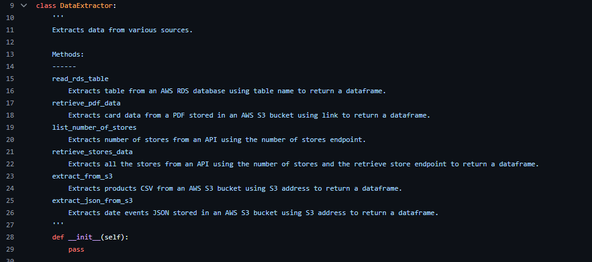
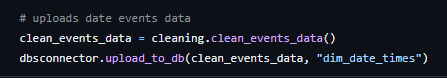

# Multinational-Retail-Data-Centralisation

This project involved extracting and cleaning data from multiple sources and sending this data into one centralised Postgresql database in pgAdmin4.

## Milestone 1

The first milestone was to set up the Github repository aswell as the dev environment. For this project several modules were imported including sqlalchemy, pandas, numpy, tabula and requests. 

## Milestone 2

The second milestone was to extract all of the necessary data from multiple sources and clean all of this data. First a database was set up within pgAdmin 4 called `sales_data` which was later used to store all the company information and data.

Then three python files were created `data_extraction.py`, `database_utils.py` and `data_cleaning.py` each with three separate classes intialised: `DataExtractor`, `DatabaseConnector` and `DataCleaning`.

- This class contained all the methods to help extract data from the different data sources.

- This class was used to connect with and upload data to the `sales_data` database.

- This class contained all the methods to clean the data from all of the sources.

# User data

The user data was the historical data of the users stored in an AWS database.

- A yaml file `db_creds.yaml` was created to contain all the database credentials containing the user data. This file was added to the `.gitignore` file so it wouldn't be visible publicly on Github. This method `read_db_creds` was used to read this yaml file and return the credentials as a dictionary.

- The `init_db_engine` method in the `DatabaseConnector` class was used to initialise and return a sqlalchemy database engine as the `source_engine` using the database credentials from earlier.

- The `list_db_tables` was used to extract and list all the table names present within this database.

- The `read_db_tables` method in the `DataExtractor` class was used to extract a database table to return a dataframe using a table name as an argument.

- The `clean_user_data` method in the `DataCleaning` class was used to perform the cleaning of the user data. The `legacy_users` table was used to extract the user data firstly. Then the index value was set to the index column using `DF.set_index("index")`.

- Any null values were replaced with NaN and dropped using `DF.replace("NULL", np.nan)` and `DF.dropna()`.

- A mask was created to filter valid countries, eliminating any irregular values in this column using `DF["column_name"].isin()` and then `DF[mask]`.

- The incorrect country code of `GGB` was replaced with `GB` using `DF.replace()`.

- Finally the dates were put into the correct format using `pd.to_datetime(DF["column_name"], format="mixed")`. This cast the column into the date time format while the `"mixed"` flag accounted for different date formats.

- The `upload_to_db` method was used to upload data to the `sales_data` database using new credentials from the yaml file aswell as the dataframe and desired table name within pgAdmin4 as arguments.  

- The `DatabaseConnector()` class was intialised and the `DataCleaning()` class was imported and also intialised to return the cleaned user data as `clean_user_data` and then upload this data to the database under the table name `dim_users`.

# Card data

The card data was the data of the users card details stored in a PDF in an AWS S3 bucket.

-

-

-

# Store data

The store data was the data of the store details and was extracted through the use of an API.

-

-

-

-

# Products data

The products data was the data of each product the company sells stored as a CSV in an S3 bucket.

-

-

-

-

-

# Orders data

The orders data was the data for all orders the company made stored in an AWS RDS. This table was to be the single source of truth and used to link all the tables later.

-

-

# Data events data

The data events data was the data of when each sale happened as well as related attributes and was stored as a JSON file.

-

-

-

## Milestone 3

This milestone was

-

-

-

-

-

-

-

-

-

## Milestone 4

This milestone was

-

-

-

-

-

-

-

-

-

-

-

-

-

-

-

-

-

-